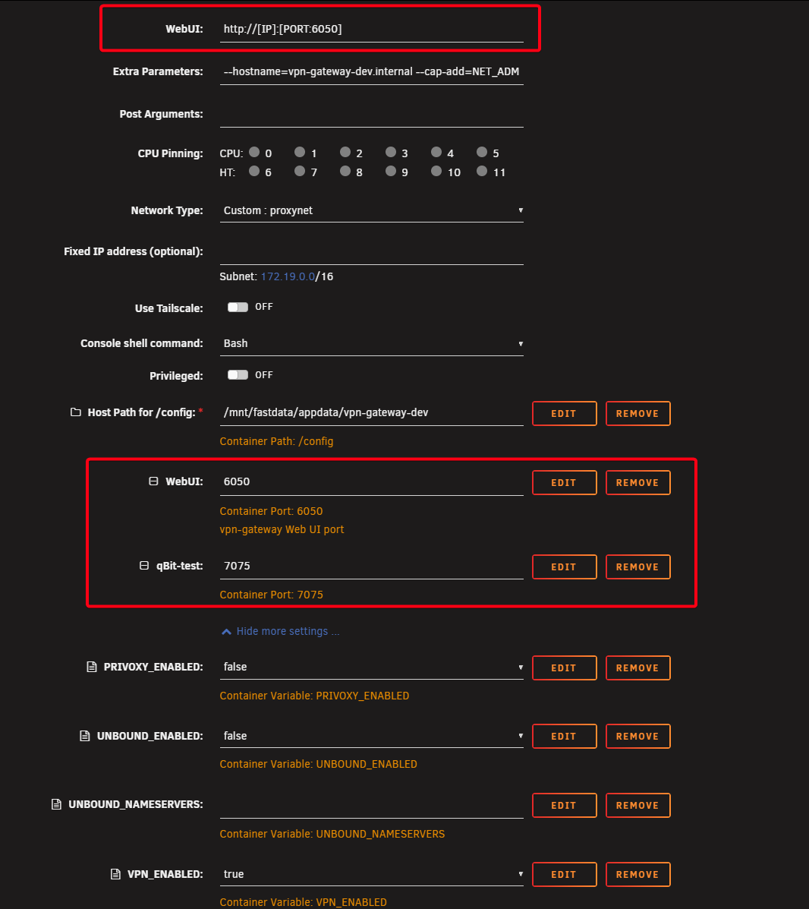
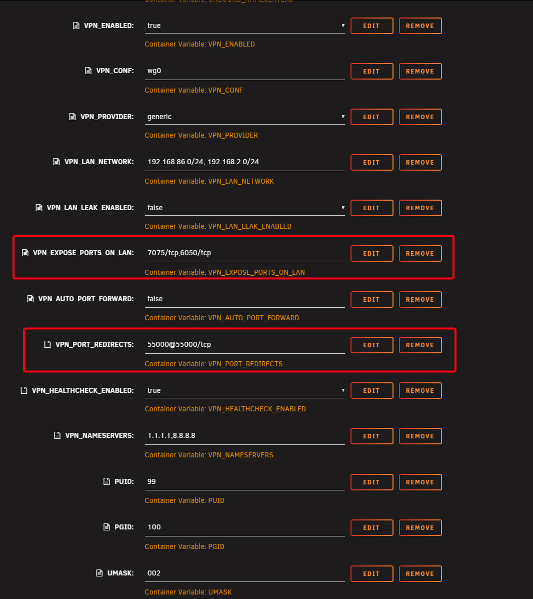
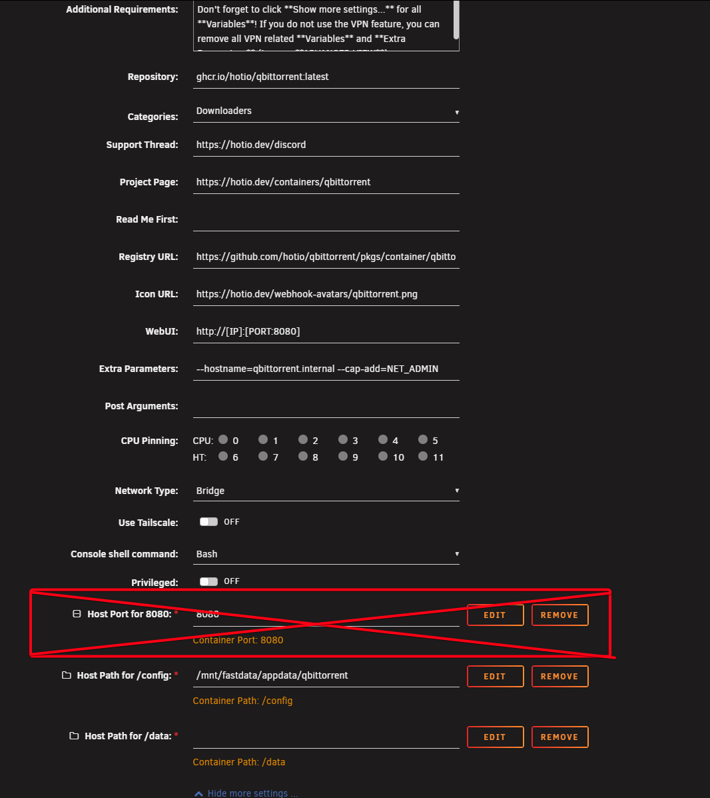
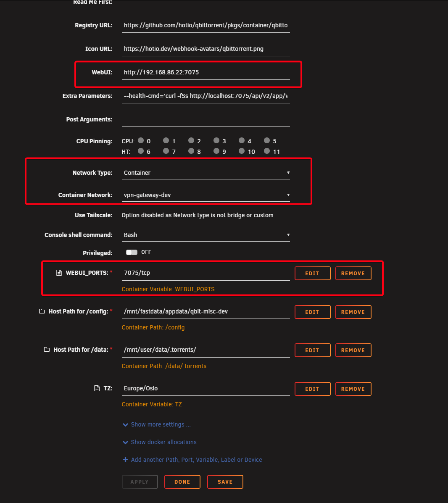

# Routing qBittorrent through vpn-gateway

This is the main use case: run one or more qBittorrent containers through the VPN gateway so all torrent traffic is encrypted, while the Web UI remains accessible on your LAN.

## How it works

When a qBittorrent container uses `container:vpn-gateway` as its network, it shares the gateway's network stack. The container has no network of its own — all traffic (including the Web UI) goes through the VPN gateway. This means:

- **Port mappings on the qBittorrent container are ignored** — don't set them
- **Ports must be mapped on the vpn-gateway container** — this is where you expose the qBit Web UI
- **The same port number must match** in three places on vpn-gateway and one place on qBittorrent

## Setup guide (TorGuard + WireGuard example)

This example uses TorGuard with WireGuard and hotio/qBittorrent on Unraid. The same approach works with any VPN provider that supports WireGuard — just use `VPN_PROVIDER=generic` and provide your own `wg0.conf`.

In this example, **7075** is the qBittorrent Web UI port. You can use any available port — just make sure the same number is used in all the places described below.

### Step 1: Add port mappings on vpn-gateway

The qBittorrent Web UI is accessed through the vpn-gateway container, not qBittorrent itself. Add a port mapping for each qBit instance, plus the vpn-gateway Web UI port.



| Port mapping | Purpose |
|--------------|---------|
| `6050:6050` | vpn-gateway Web UI |
| `7075:7075` | qBittorrent Web UI |

The `WebUI` field at the top uses `http://[IP]:[PORT:6050]` — this is vpn-gateway's own UI, not qBit's.

### Step 2: Set vpn-gateway variables

Two variables are essential for the qBit connection (highlighted in red):



| Variable | Value | Purpose |
|----------|-------|---------|
| `VPN_EXPOSE_PORTS_ON_LAN` | `7075/tcp,6050/tcp` | Opens these ports through the VPN firewall for LAN access. **Must include** the qBit port (7075) and the vpn-gateway Web UI port (6050) |
| `VPN_PORT_REDIRECTS` | `55000@55000/tcp` | Routes your TorGuard port forward to qBit's incoming torrent port. The number before `@` is the port from TorGuard, after `@` is the port qBit listens on for incoming peer connections |

The other VPN variables (`VPN_ENABLED`, `VPN_CONF`, `VPN_PROVIDER`, etc.) configure the VPN connection itself — see [hotio documentation](https://hotio.dev/containers/base/) for details. For TorGuard, use `VPN_PROVIDER=generic` with your WireGuard config in `/config/wireguard/wg0.conf`.

### Step 3: Remove port mapping and disable VPN on qBittorrent

Since qBittorrent shares the vpn-gateway network, two changes on the qBit container are required:

1. **Remove the host port mapping** — it does nothing in container network mode and can cause conflicts
2. **Set `VPN_ENABLED=false`** — the vpn-gateway handles VPN, not qBittorrent. Having VPN enabled on both will prevent qBittorrent from starting. You can leave the other VPN variables as they are, or remove them entirely — both work fine.



### Step 4: Configure qBittorrent network and Web UI port

Set qBittorrent to use the vpn-gateway container's network and add the `WEBUI_PORTS` variable with the same port number:



| Setting | Value | Why |
|---------|-------|-----|
| `WebUI` | `http://192.168.86.22:7075` | Points to the vpn-gateway host port — this is how you access qBit's UI |
| `Network Type` | `Container` | Share the vpn-gateway's network stack |
| `Container Network` | `vpn-gateway` | Select your vpn-gateway container |
| `WEBUI_PORTS` | `7075/tcp` | Tells qBittorrent which port to listen on internally. **Must match** the port mapped on vpn-gateway. Use the hotio format: number + `/tcp` |

### Step 5: Set qBittorrent incoming port

Open the qBittorrent Web UI → Settings → Connection → **Port used for incoming connections**: set this to the port after `@` in `VPN_PORT_REDIRECTS` (55000 in this example). This must match the static port forward configured in your TorGuard account.

### Summary: where port 7075 appears

The qBit Web UI port must match in **four places** — three on vpn-gateway, one on qBittorrent:

| Location | Setting | Value |
|----------|---------|-------|
| vpn-gateway | Port mapping (host) | `7075` |
| vpn-gateway | Port mapping (container) | `7075` |
| vpn-gateway | `VPN_EXPOSE_PORTS_ON_LAN` | `7075/tcp` |
| qBittorrent | `WEBUI_PORTS` | `7075/tcp` |

## Docker Compose example

A complete working example with vpn-gateway (TorGuard/WireGuard) and one qBittorrent instance:

```yaml
services:
  vpn-gateway:
    image: ghcr.io/prophetse7en/vpn-gateway:latest
    container_name: vpn-gateway
    cap_add:
      - NET_ADMIN
    sysctls:
      - net.ipv6.conf.all.disable_ipv6=1
    ports:
      - "6050:6050"   # vpn-gateway Web UI
      - "7075:7075"   # qBittorrent Web UI
    environment:
      - VPN_ENABLED=true
      - VPN_CONF=wg0
      - VPN_PROVIDER=generic
      - VPN_LAN_NETWORK=192.168.86.0/24
      - VPN_EXPOSE_PORTS_ON_LAN=7075/tcp,6050/tcp
      - VPN_PORT_REDIRECTS=55000@55000/tcp
      - VPN_HEALTHCHECK_ENABLED=true
      - PUID=99
      - PGID=100
      - UMASK=002
      - TZ=Europe/Oslo
    volumes:
      - /path/to/vpn-gateway/config:/config

  qbittorrent:
    image: ghcr.io/hotio/qbittorrent:latest
    container_name: qBit-movies
    network_mode: "container:vpn-gateway"
    # No ports: section — ports are mapped on vpn-gateway
    environment:
      - VPN_ENABLED=false
      - WEBUI_PORTS=7075/tcp
      - PUID=99
      - PGID=100
      - UMASK=002
      - TZ=Europe/Oslo
    volumes:
      - /path/to/qbittorrent/config:/config
      - /path/to/data:/data
```

> **Key points:** `ports` only on vpn-gateway, `network_mode: "container:vpn-gateway"` on qBit, `VPN_ENABLED=false` on qBit, and `WEBUI_PORTS=7075/tcp` matching the gateway port mapping.

## Multiple qBittorrent instances

Each instance needs a **unique port** since they all share the same network stack:

| Instance | WEBUI_PORTS | Gateway port mapping | 
|----------|-------------|---------------------|
| qBit-movies | `7074/tcp` | `7074:7074` |
| qBit-tv | `7075/tcp` | `7075:7075` |
| qBit-misc | `7076/tcp` | `7076:7076` |

All qBit ports go in `VPN_EXPOSE_PORTS_ON_LAN`:
```
7074/tcp,7075/tcp,7076/tcp,6050/tcp
```

## Troubleshooting

**qBittorrent Web UI not accessible:**
- Check that the port appears in all three vpn-gateway locations (port mapping, `VPN_EXPOSE_PORTS_ON_LAN`, container port)
- Check that `WEBUI_PORTS` on qBit matches the container port on vpn-gateway
- Check vpn-gateway logs: `docker logs vpn-gateway`

**qBittorrent won't start:**
- Remove all port mappings from the qBit container — they conflict with container network mode
- Set `VPN_ENABLED=false` on qBit (or remove VPN variables entirely) — the gateway handles VPN

**Multiple instances conflict:**
- Each qBit instance must have a different `WEBUI_PORTS` value
- You cannot have two containers both listening on the same port on the same network stack

**Port forwarding not working:**
- Verify `VPN_PORT_REDIRECTS` format: `vpn_port@container_port/tcp`
- Verify qBittorrent's incoming connection port matches the container port (after `@`)
- Verify the port forward is active in your VPN provider's account
